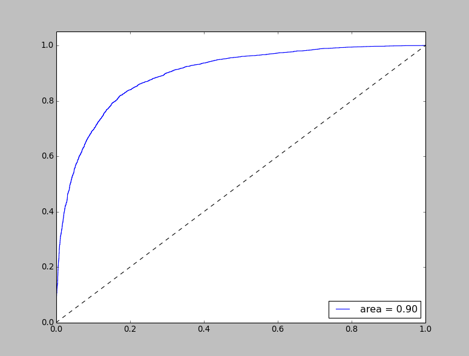

# sentiment-analysis-word2vec

## This project shows how to design a simple sentiment analysis for movie reviews using trained vectors from Google word2vec model

You can download the pre-trained Google word2vec vectors trained on Google news here - https://code.google.com/p/word2vec/
The name of the file is  GoogleNews-vectors-negative300.bin.gz

The required dataset is already present in this project

To know the list of parameters accepted by the program type

    python src/SentimentClassifierDemo.py -h
    
The following parameters are required to run the program

#####     -word2vec_model  The path to the file containing the Google word2vec model (compressed .gz file)
#####     -positive_dataset The path to the file containing the positive dataset. This file should contain one review per line 
#####     -negative_dataset The path to the file containing the negative datset. This file should contain one review per line
#####     -validation_proportion The fraction of the datset to be considerd for validation. Should be < 1.0 Ex: 0.2
#####     -log_file LOG_FILE The path to the file that will contain the log messages

Run the code with the following parameters as follows.

    python src/SentimentClassifierDemo.py 
        -word2vec_model GoogleNews-vectors-negative300.bin.gz 
        -positive_dataset positive_reviews.txt 
        -negative_dataset negative_reviews.txt 
        -validation_proportion 0.2 
        -log_file SentimentClassifier_log.txt
        
The code will display the ROC curve for the classifier and also will print the accuracy of the classifier along with the recall and precision of the positive sentiment class.

The ROC curve should look something like this:

If you want to build your own Word2Vec model rather than using the trained Google model, and then use that model for training the classifier, run the below file

    python src/Word2VecBuilder.py -h
    
It accepts the below parameters

#####     -word2vec_model  The path to the file that will contain the trained Word2Vec model
#####     -corpus The path to the file containing the sentences, one sentence per line 
#####     -log_file The path to the file containing log messages

Run the code with the following parameters as follows:

    python src/Word2VecModelBuilder.py
        -word2vec_model data/MyWord2VecModel.word2vec
        -corpus my_custom_data.txt
        -log_file Word2VecBuilder_log.txt
        
The code will display the ROC curve for the classifier and also will print the accuracy of the classifier along with the recall and precision of the positive sentiment class.

The ROC curve I got with custom corpus looked like this:

    

